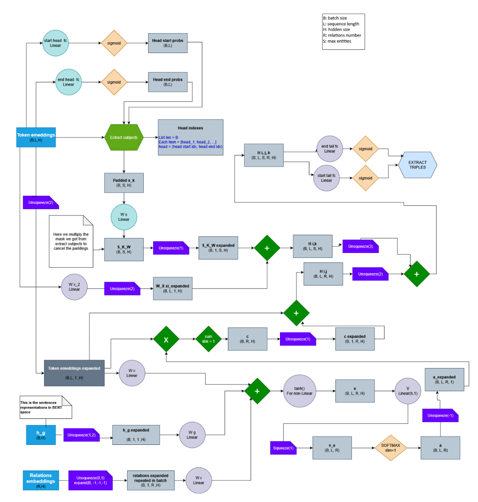

  

# Triples extraction using BRASK
Train neural network to extract triples (head, relation, tail) from wikidata5m dataset using [BRASK](docs/Bidirectional%20relation-guided%20attention%20network.pdf) algorithm.
The project report is available at [REPORT](docs/report.pdf)


## Training graph:



## Download dataset:
```
    curl -L -o wikidata5m_text.txt.gz "https://www.dropbox.com/s/7jp4ib8zo3i6m10/wikidata5m_text.txt.gz?dl=1" && gunzip wikidata5m_text.txt.gz    
    curl -L -o wikidata5m_alias.tar.gz "https://www.dropbox.com/s/lnbhc8yuhit4wm5/wikidata5m_alias.tar.gz?dl=1" && gunzip wikidata5m_alias.tar.gz && tar -xvf wikidata5m_alias.tar
    curl -L -o wikidata5m_transductive.tar.gz "https://www.dropbox.com/s/6sbhm0rwo4l73jq/wikidata5m_transductive.tar.gz?dl=1" && gunzip wikidata5m_transductive.tar.gz && tar -xvf wikidata5m_transductive.
```

## Codebase:
The first version of the code exists inside **/archive**, now I am refactoring the steps in the root file. The new code for the training pipeline is not totally ready, the old code of archive worked but only using big GPU RAM and using pytorch ddp, that's the main reason of the refactoring process.

## Do the training:

** 1- Minimize **:
Wikidata5m is a huge dataset, so if you are running on low RAM, you need to minimize it so you can test the algorithm, that's why you can run minimize.py by: 

```
python minimize.py
```

The script will ask you the minimize factor (between 0 and 1), then it will calculate approximate numbers of the size of descriptions after minimization and you can proceed by typing y.
After it runs 4 streaming passes (triples, descriptions, relations, aliases) and save the minimized files.

After when you execute other steps, the terminal will ask you if you want to perform the operations on the minimized version or the full dataset.


** 2- Normalize **:

Normalization cleans descriptions and aliases so they are ready for downstream NLP tasks. Run it with:

```
python normalize.py
```

The script will ask whether to normalize the minimized dataset or the full dataset (default: minimized). If the minimized files are missing, it will prompt you to run `minimize.py` first.

It then warns you which files will be overwritten and asks for confirmation before proceeding.

Normalization steps applied to each value in **descriptions** dictionary:
- Replace special characters with their equivalent (e.g. `á→a`, `é→e`, `&→and`)
- Remove words that contain non-English characters
- Apply Unicode NFKC normalization
- Collapse multiple spaces
- **Does NOT lowercase**
- **Does NOT remove stop words**


Normalization steps applied to each list of **aliases**:
- Replace special characters with their equivalent (e.g. `á→a`, `é→e`, `&→and`)
- Skip aliases that are English stop words
- Apply Unicode NFKC normalization
- Collapse multiple spaces
- Lowercase the result
- Deduplicate aliases per entity

The normalized files overwrite the source `.pkl` files in `data/minimized/` or `data/preprocessed/` depending on the choice made.


** 3- Embed relations **:

This step produces one 768-dimensional BERT embedding per relation, averaged across all its text aliases. Run it with:

```
python embed_relations.py
```

The script will ask whether to embed the minimized or the full dataset (default: minimized). If the source `relations.pkl` file is missing, it will prompt you to run the appropriate prior step first.

It then warns you which file will be overwritten and asks for confirmation before proceeding.

**Embedding approach:**
- Loads `bert-base-cased` at runtime (not at import time) and moves it to GPU if available
- Flattens all aliases across all relations into a single list and processes them in batches (`BATCH_SIZE = 32` on CPU, `8192` on CUDA)
- Each alias embedding is the attention-mask mean-pool of the average of BERT's last two hidden layers
- Per-alias embeddings are accumulated per relation with `scatter_add_` and divided by alias count → one averaged embedding per relation
- Uses `torch.autocast` for mixed-precision (float16 on CUDA, bfloat16 on CPU)
- Relations with no aliases fall back to using the relation ID itself as input text

**Output:** a compressed `.npz` file of shape `(n_relations, 768)` saved to:
- `data/minimized/relation_embeddings.npz` (minimized)
- `data/preprocessed/relation_embeddings.npz` (full dataset)

